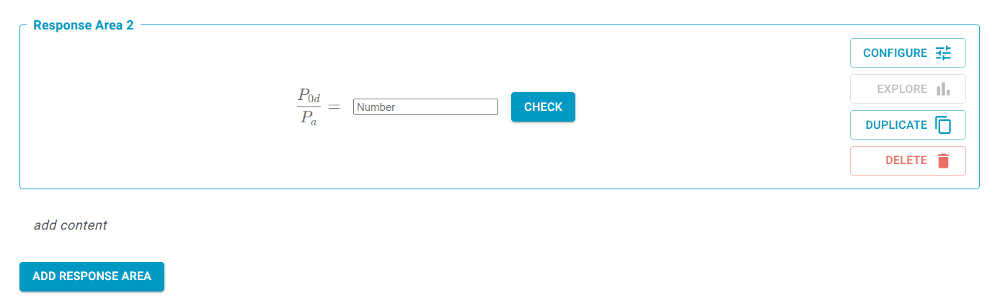
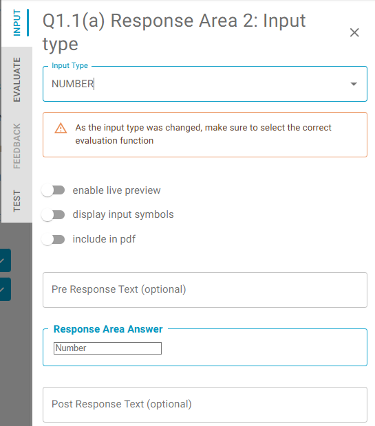

# Response Area Components

Response Areas are the interactive elements your students will use to submit their answers. They check an input given by the student, and provide feedback. As React components, they admit a certain number of parameters which are described in this section.

## Response Area creation

Response areas are added to the question field, and are configured for each question in the set.

### Add Response Area

You can add any number of response areas to a question part. These may be separated by text fields. If desired, adding a double space in the field will space out response areas.

### Duplicate

You can duplicate the response area within the same part by clicking on the duplicate icon.

*   **What gets copied:** All teacher-configured settings are duplicated. This includes the input type, evaluation function, pre/post text, the correct answer, tests, and any feedback cases you've set up.
*   **What is NOT copied:** Any data generated during use is not carried over. This includes comments, flags, likes, and student submissions.

### Reorder

It is possible to reorder response areas within the part using the "drag and drop" feature. It works in the same way as reordering of parts.

### Delete Response Area

You can delete a response area without any restrictions. A pop-up message appears to confirm the deletion.

If students have already submitted answers to the response area you are deleting, the confirmation message will warn you.

See more information about analytics for deleted response areas in [Analytics](../../guides/analytics)

## Response Area configuration

To configure a response area, click the configure button:

This opens the **Response Area Panel**, separated into four tabs:

1.  **Input:** Define what the student sees and how they answer.
2.  **Evaluate:** Set up the logic for how the answer is checked.
3.  **Feedback:** Create customised feedback for different correct or incorrect answers.
4.  **Test:** Define correct and incorrect answers to test your configuration to ensure it works as expected.

### 1. Input

- Select an input style for the student by scrolling or filtering. These consist of the following:
    - Matrix
    - Number
    - Boolean (true/false)
    - Text (for short text answers)
    - Table
    - Multiple-choice
    - Expression (gives a preview for the typed symbolic expression)
    - Numeric units (separate fields for a number and its units)
    - Code
    - Essay (for long text answers)
    - Milkdown

Each field has suitable evaluation functions. For example, a simple numerical answer is best suited to 'Number', as this supports isSimilar, while assessing an equation is best suited to the 'Expression' field, as this supports compareExpressions.

In short, choose the most suitable input style for your desired answer.

- **Configuration Options**

    - **Enable live preview**: Renders the typed expression in realtime. Allows to validate student input before submitting. `Default: TRUE` for the EXPRESSION input type.
    - **Display input symbols**: Displays the symbols and associated shortcut codes that may be required for a problem beneath the input field. These are configured in the 'Evaluate' tab. `Default: FALSE`.
    - **Include in PDF**: Only affects the PDF version. Includes pre/post response text in the PDF, with a blank space between. `Default: FALSE` except for Multiple-choice.
    - **Pre/post response text** (optional): Add text before and after the response area to clarify to students what to input. Accepts plain text, and single-dollar-delimited latex. E.g. `Estimate $f(x)=$` is acceptable. When using fractions in this field, use `$\dfrac{}{}$` as this is more legible.
    - **Response Area Answer**: Enter a reference answer. This will typically be the absolute solution to a problem. When requesting a symbolic answer, you must use the variable names (codes) you define in the 'Evaluate' tab.  Configure the answer where relevant (e.g. number of rows and columns).
    - **Response Area Preview**: Shows you what the configured response area will look like.
  
### 2. EVALUATE

Configure how student expressions are evaluated.

This is a 'no code' parametric configuration. Settings will be upgraded as the system improves.

- **[Evaluation Function](https://lambda-feedback.github.io/user-documentation/teacher/reference/evaluation_functions/)** - Select an evaluation function from the list. For example:
    - `isSimilar`: Best for numerical answers. It performs a basic comparison, allowing for a configurable tolerance (absolute and relative).
    - `compareExpressions`: Best for symbolic answers (e.g., equations).
- **Evaluation Function Parameters** - Configure as provided, and add new parameters as required. Details depend on the selected Evaluation Function.
-   **Input Symbols:** This is a powerful feature for defining a dictionary of accepted symbols. For each symbol, you define:
    *   **Symbol:** The LaTeX-rendered symbol (e.g., `$f(x)$`).
    *   **Code:** The machine-readable variable name (e.g., `fx`). This is what you use in your reference answer and what the evaluation function sees.
    *   **Alternatives:** A list of other codes you want to accept for the same symbol (e.g., `f_x`, `f(x)`, `f`). This allows you to anticipate different ways students might type the same thing.
    *   **Visibility:** A `TRUE`/`FALSE` toggle. If "Display input symbols" is enabled in the Input tab, this setting determines whether a specific symbol is shown to the student. This allows you to show students common symbols while still accepting less common or alternative ones in the background.

- **Input Symbols** - Define a dictionary of symbols and their equivalent in code form.
    - This essentially associates a LaTeX-rendered symbol with a machine-readable variable label, with the LaTeX render returned to the student through the preview. These symbols may also be hidden to students.
    - All inputs are plain text. For example, the symbol `$f(x)$` may have code `fx` and alternatives `f_x`, `f(x)`, `f`. This dictionary will be provided to the evaluation function, even if the teacher has not displayed it to the student. This allow teachers to accept several alternative symbols, such as those with different cases or conventional expressions.
    - The configuration of input symbols is a very important part of providing high quality feedback.
    - Note that the 'visibility' Boolean applies if input symbols are displayed to students, otherwise it is irrelevant. It allows Teachers to communicate some symbols to students, while keeping others hidden to the student but visible to the evaluation function.

### 3. FEEDBACK

Add alternative reference answers, 'cases', with customised parameters, so that multiple cases can be dealt with independently. Cases can be used to capture multiple correct approaches that are not equivalent. Cases can also be used to identify common incorrect approaches and to provide customised feedback. The FEEDBACK tab is typically populated after students start using the system, and when data is available to point to common expressions. Configuring a case works similarly to setting up the default answer in the INPUT tab, with added options for changing the colour of the given feedback, give custom feedback and toggling whether the case answer should be considered correct or not. Adding custom feedback will overwrite the feedback produced by the evaluation function. When a response is submitted, it is evaluated for all cases and feedback for the first case that matches will be displayed. When determining which matched case is first, the default answer described in the INPUT tab will take precedence over all other cases, otherwise the feedback for the matched case with the lowest number will be displayed (i.e. the answer given in the INPUT tab can be considered to be Case 0).   Feedback fields also support LaTeX equations in both `$f(x)$` and `$$f(x)$$` formats, and Markdown inputs such as line breaks. Make sure to follow good typesetting practice in this field.

### 4. TEST

tests provide a systematic way to log what behaviour the teacher expects. It provides a useful record and an efficient way to retest the bevhaiour of a response area over time (e.g. as evaluation functions evolve, or as the subject matter itself changes).

## Restrictions on changes: the input type

It is possible to change the input type (e.g. from _Text_ to _Number_) without any restrictions until the response area is saved (with or without publishing) to students.

After the response area is saved, it is still possible to change the input type, but it will result into replacing the response area by a new one. The previous response area will still exist, but only on the previous version of the question. When replacing the response area, all response area content data (those entered by teachers including tutorials, final answer and worked solutions) are copied, but any existing response area event data (student answers, click events and statistics) will remain linked only to the previous response area.

Student answers, click events and statisticsthose data are never lost by deleting a response area, they are always preserved. Once a question is saved (with or without publishing), then any new changes are saved into a new (draft) version of the question. So, if e.g. a response area is deleted after a question was published, then it is deleted from the draft version only. And if this draft version is later published, then the previously published version is preserved (and with it the "deleted" response area and linked submissions).

The reason why the input type change is restricted is to preserve high quality data analytics as explained in the examples below.

### An Example 1 - changing input type on PUBLISHED response area

#### FIRST Part
- The teacher creates a new question with Response Areas RA1 and RA2. -> The version of the question is QV1 with status DRAFT.
- The teacher is making changes (including the change of the input type if needed). -> The changes are being saved into QV1 with no restrictions
- The teacher performs PUBLISH action (let's assume RA1 and RA2 input types are both _Number_ for this example). -> The QV1 version status is changed to PUBLISHED
- Students are submitting their answers -> submissions are recorder against Response Area RA1 and RA2 (in the single _Number_ format for both response areas)
- The teacher clicks on a question to edit it -> with the first click a new question version QV2 is created with status DRAFT
- The teacher makes following changes (which are being recorded against QV2):
    - In RA1: adds a new Input Symbol -> the change is recorded against RA1
    - In RA2: the teacher unlocks and changes the input type -> RA2 is deleted (from the question version QV2) and a new response area RA3 is created (let's assume input type _Table_ for this example)
- The teacher performs PUBLISH action -> the QV2 is published (with response area RA1 with input type _Number_ and response area RA3 with input type _Table_)
- Students are submitting their answers -> submissions are recorder against Response Area RA1 (in the single _Number_ format) and against Response Area RA3 (in the _Table_ format)

  => No submissions are lost. The original submissions (in the _Number_ format) are linked to the RA2, which is preserved on the question version QV1. New submissions (in the _table_ format) are linked to the RA3 which is recorded on the question version QV2.

**Please note:** All statistics and submissions are currently displayed against the published question version only. So, though the submissions against RA2 are preserved, it is not currently possible to see them. We are working on the improvement to make this possible.

#### SECOND Part - this is an extension of the FIRST Part
- The teacher decides to REVERT (the question created in the FIRST Part) to the question version QV1 -> a new question version QV3 is created and the content of the QV1 is copied to QV3 -> QV3 is DRAFT version which contains RA1 (input type _Number_) and RA2 (input type _Number_)
- The teacher performs PUBLISH action -> the QV3 is published and the teacher can now see submissions against RA1 and RA2, but he cannot see anymore submissions against RA3 (these are preserved against the QV2 version)

### An Example 2 - changing input type on SAVED response area

- The teacher creates a new question with Response Areas RA1 and RA2. -> The version of the question is QV1 with status DRAFT.
- The teacher is making changes (including the change of the input type if needed). -> The changes are being saved into QV1 with no restrictions
- The teacher performs SAVE action (let's assume RA1 and RA2 input types are both _Number_ for this example). -> The QV1 version status is changed to SAVED
- The teacher clicks on a question to edit it -> with the first click a new question version QV2 is created with status DRAFT
- The teacher makes following changes (which are being recorded against QV2):
    - In RA1: adds a new Input Symbol -> the change is recorded against RA1
    - In RA2: the teacher unlocks and changes the input type -> RA2 is deleted (from the question version QV2) and a new response area RA3 is created (let's assume input type _Table_ for this example)
- The teacher performs PUBLISH action -> the QV2 is published (with response area RA1 with input type _Number_ and response area RA3 with input type _Table_)
- Students are submitting their answers -> submissions are recorder against Response Area RA1 (in the single _Number_ format) and against Response Area RA3 (in the _Table_ format)
- The teacher decides to REVERT to the question version QV1 -> a new question version QV3 is created and the content of the QV1 is copied to QV3 -> QV3 is DRAFT version which contains RA1 (input type _Number_) and RA2 (input type _Number_)
- The teacher performs PUBLISH action -> the QV3 is published and the teacher can now see submissions against RA1. There are no submissions against RA2 as it has not been (until now) published. Submissions against RA3 are not visible, but they are preserved against the question version QV2.

### An Example 3 - adding new response area to a published question

- The teacher creates a new question with Response Areas RA1 and RA2. -> The version of the question is QV1 with status DRAFT.
- The teacher is making changes (including the change of the input type if needed). -> The changes are being saved into QV1 with no restrictions
- The teacher performs SAVE (or PUBLISH) action (let's assume RA1 and RA2 input types are both _Number_ for this example). -> The QV1 version status is changed to SAVE (or PUBLISHED)
- The teacher clicks on a question to edit it -> with the first click a new question version QV2 is created with status DRAFT
- The teacher adds a new response area RA3

  => At this point the teacher is making changes in the question version QV2 (DRAFT) in which:

    - The input types of RA1 and RA2 are locked, because they exist on a saved version QV1. It does not matter if QV1 is (only) saved or published or if there are  or there are not existing submissions. The reason why it is locked is that the teacher can revert into this version later after submissions are created. By locking it we are making sure that the "unlock" process will be triggered which will preserve the original response area and it will create a new response area and it will make sure that the submissions are linked to response area with compatible input type.
    - The input type of RA3 is not locked at this point, because RA3 does not (yet) exist on any saved question version.
